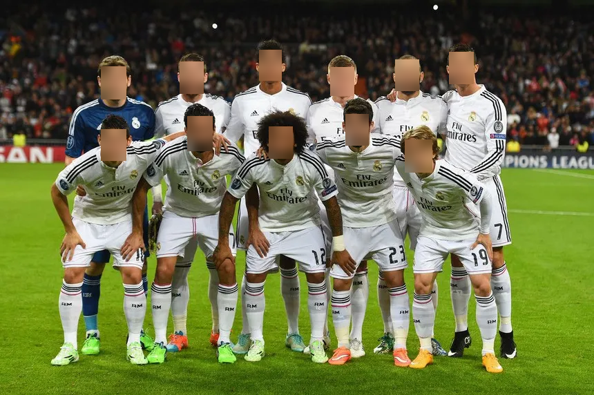
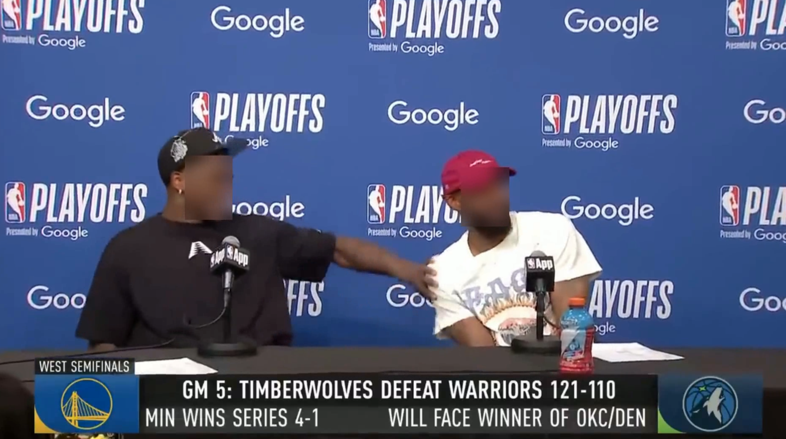

# Face Censorship

This repo contains my code for faces censorring both in image and video. I use RetinaFace for the face detector because I don't want to train my own model. RetinaFace will return the points of faces area. I added red-rectangle to the faces using those faces area from RetinaFace.

## Getting Started

1. Clone this repo
2. Create virtual environment `python -m venv env` and activate it `source env/Scripts/activate`
3. Install packages `pip install -r requirements.txt`
4. Adjust the input and output
5. Run the main program `python main.py`

## Input and Output Example

### Image

### Video

## Misc

You can check my code in Kaggle notebook [here](https://www.kaggle.com/code/iqbalpahlevi/face-censorring). I recommend you to use Kaggle notebook if your PC doesn't have GPU.
